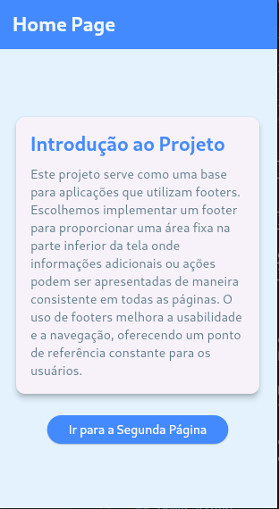
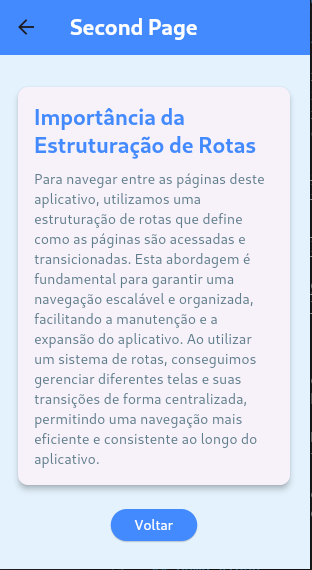

# Hello World Flutter

Welcome to the **Hello World Flutter** project! 🎉 This is a base project designed to help you get started with Flutter development for mobile apps. It demonstrates the core structure and routing for a Flutter application.


## Features

- **Home Page**: The entry point of the application with a button to navigate to the second page.
- **Second Page**: Demonstrates routing and provides a back button to return to the home page.
- **Routing**: Implemented using the `AppRoutes` class to manage navigation between pages.

## Demo Photos

<html>
  <div class="container-images" style="padding: 20px !important;">
    <ul style="display: flex !important; list-style: none !important; gap: 1em !important; align-items: center !important; justify-content: center !important; align-self: center !important;">
      <li>
        
      </li>
      <li>
        
      </li>
    </ul>
  </div>
</html>


## Getting Started

To get started with this project, follow these steps:

1. **Install Dependencies**:
   ```bash
   flutter pub get
   ```
2. **Run the Application**:
   ```bash
   flutter run
   ```

## Dependencies

- Flutter
- Dart
- Android SDK
